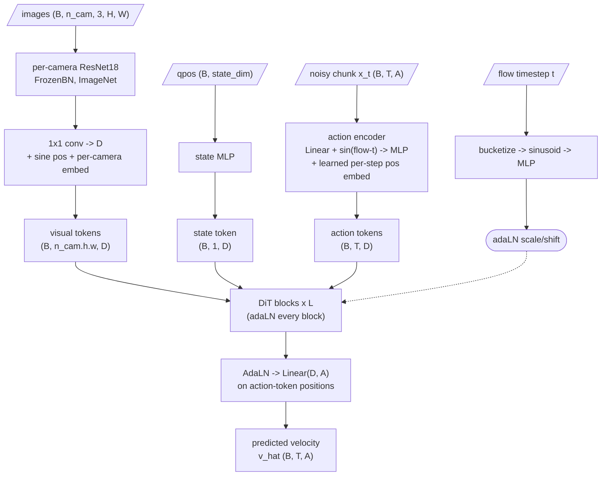
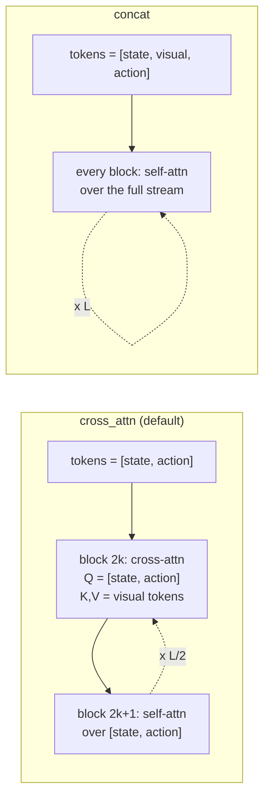

# DiffusionFlow policy

A **flow-matching (rectified-flow) visuomotor policy** whose denoiser is a DiT modelled
on [NVIDIA gr00t-n1d7](https://github.com/NVIDIA/Isaac-GR00T) (`gr00t/model/gr00t_n1d7`
+ `gr00t/model/modules/dit.py`, Apache-2.0), scaled down and re-wired to use ACT's
ResNet CNN backbone instead of a VLM.

It slots in next to `ACT` / `CNNMLP` as `--policy_class DiffusionFlow` and reuses the
whole ACT training / eval / task-space stack unchanged.

| | |
|---|---|
| Model | `detr/models/diffusion_flow.py` — `DiffusionFlowModel`, `build_diffusion_flow` |
| Wrapper | `policy.py` — `DiffusionFlowPolicy` |
| Builder / optimizer | `detr/main.py` — `build_DiffusionFlow_model_and_optimizer` |
| Self-test | `python -m detr.models.diffusion_flow` |

---

## Why flow matching

ACT predicts an action chunk with a single feed-forward pass and an L1 loss under a
CVAE. DiffusionFlow instead learns a **velocity field** that transports Gaussian noise
to the expert action chunk, and integrates it at inference. This trades one network
eval for `--n_inference_steps` evals (default 4) in exchange for a multimodal,
higher-capacity action distribution, with no KL term to balance.

---

## Architecture



- **`D`** = `--hidden_dim` (default 512), **`T`** = `--chunk_size` (action horizon),
  **`A`** = action dim (`14` joint-space, or `ee_transforms.state_dim(rot_repr)` in
  task-space: quat→16, rpy→14, rot6d→20).
- **Visual encoder**: `build_backbone` (ResNet18, frozen BatchNorm, ImageNet weights),
  one instance per camera, exactly as ACT. Last feature map → `1×1` conv to `D`,
  flattened to tokens, plus the DETR sine positional embedding and a learned
  per-camera embedding so views stay distinguishable.
- **Proprio**: 2-layer MLP → a single state token.
- **Action / flow-time encoder** (gr00t `MultiEmbodimentActionEncoder`, single
  embodiment): `Linear(x_t)` concatenated with a sinusoidal embedding of the flow
  timestep, fused by a 2-layer MLP, plus a learned per-step positional embedding
  (`add_pos_embed`).
- **Timestep conditioning**: the flow timestep is bucketized (`num_timestep_buckets =
  1000`), sinusoidally embedded, MLP'd, and injected as **adaLN** (scale+shift, not
  zero-init, no gate) on the pre-attention norm of every DiT block and once more before
  the output head.
- **Output**: `AdaLN` + `Linear(D, A)` on the action-token positions → predicted
  velocity.

### `--dit_arch`: two conditioning designs to compare

| `--dit_arch` | Token stream | Attention | Vision reaches actions via |
|---|---|---|---|
| `cross_attn` *(default)* | `[state, action]` | blocks alternate: even index = **cross-attention** (queries `[state, action]`, keys/values = visual tokens), odd index = **self-attention** over `[state, action]` | cross-attention (gr00t `interleave_self_attention`) |
| `concat` | `[state, visual, action]` | **pure self-attention** every block | shared self-attention stream (SD3 / MMDiT style) |



`cross_attn` is the faithful gr00t mapping (CNN tokens play the role of gr00t's VL
memory). `concat` is simpler and lets vision, state and action mix in one stream. Train
both with everything else identical and compare `sample_mse` curves + rollout success.

### Scale

Defaults are deliberately small (`hidden 512`, `dit_layers 8`, `nheads 8`, MLP ratio
`dim_feedforward / hidden_dim` ≈ 4) — gr00t-n1d7's 1536-wide / 16-layer / 32-head DiT
would badly overfit ~50 demos. All of it is CLI-configurable.

---

## Flow-matching objective

Training, per sample (faithful to gr00t-n1d7 / pi0):

```
x1        = expert action chunk           (already normalized by the dataloader)
x0        ~ N(0, I)
u         ~ Beta(1.5, 1.0)
t         = (1 - u) * 0.999               # biased toward high noise, t ∈ [0, 0.999]
x_t       = (1 - t) * x0 + t * x1         # linear interpolation path
v_target  = x1 - x0                       # constant velocity along the path
v_pred    = model(x_t, t, obs)
loss      = masked_MSE(v_pred, v_target)  # padded chunk steps (is_pad) excluded
```

`compute_loss` returns `{"loss": ...}` in training, and `{"loss": ..., "sample_mse":
...}` in validation — `sample_mse` is the masked MSE between the **Euler-sampled**
action chunk and the ground truth (an end-task signal, run only at val time since it
costs `n_inference_steps` extra forward passes). `train_bc` selects the best checkpoint
by `loss`; `plot_history` writes `train_val_loss_seed_N.png` (train + val) and
`train_val_sample_mse_seed_N.png` (val only).

Inference — explicit forward Euler, `t: 0 → 1`:

```
x = randn(B, T, A)
dt = 1 / n_inference_steps
for i in range(n_inference_steps):
    t = i * dt
    x = x + dt * model(x, t, obs)
return x                                  # (B, T, A) normalized action chunk
```

No classifier-free guidance. `--n_inference_steps 1` is nearly free and often works;
raise it (4–10) if the chunk looks jerky.

---

## Regularizers (training only, off at eval)

Both are motivated by the small multi-camera dataset: the policy should not collapse
onto proprio alone, nor onto a single camera.

### `--state_dropout_prob` (default 0.0)

Ported directly from gr00t's `state_dropout_prob`. With this probability the **entire**
`qpos` vector is zeroed before the state encoder, forcing the policy to solve the task
from vision alone on those samples. gr00t uses `0.8`; for this data start around
`0.1–0.3`.

### `--cam_dropout_prob` (default 0.0)

The same idea applied to views. Each camera is independently dropped with this
probability per sample; if that would drop every camera, one is randomly kept. A
dropped camera's visual tokens are **masked out of attention** (via `key_padding_mask`,
not zeroed), in both `dit_arch` modes. Encourages the policy to use every view rather
than overfitting to whichever one is most informative on the training set. Try
`0.2–0.4`.

---

## CLI reference

Added by this policy (see `detr/main.py` and `imitate_episodes.py`):

| Flag | Default | Meaning |
|---|---|---|
| `--dit_arch {cross_attn,concat}` | `cross_attn` | conditioning design (see table above) |
| `--dit_layers` | `8` | number of DiT blocks |
| `--n_inference_steps` | `4` | Euler steps at sampling time |
| `--state_dropout_prob` | `0.0` | prob of zeroing the whole proprio vector (train) |
| `--cam_dropout_prob` | `0.0` | per-camera prob of masking that view (train) |
| `--nheads` | `8` | attention heads |
| `--hidden_dim` | `512` | model width `D` |
| `--dim_feedforward` | `2048` | DiT MLP hidden size (→ MLP ratio `= /hidden_dim`) |

Reused from the ACT CLI: `--chunk_size` (**required** — the action horizon `T`),
`--lr`, `--seed`, `--batch_size`, `--num_epochs`, `--task_name`, `--dataset_dir`,
`--num_episodes`, `--temporal_agg`, `--num_rollouts`, and the task-space flags
`--task_space`, `--rot_repr {quat,rpy,rot6d}`, `--action_repr
{absolute,delta,relative}`.

The CNN backbone keeps its own optimizer param-group at `lr_backbone = 1e-5`
(hardcoded in `imitate_episodes.main`, same as ACT).

---

## Usage

Headless machines first: `source wsl_gl.sh headless` (sets `MUJOCO_GL=egl`,
`MPLBACKEND=Agg`).

### Task-space (EE pose), rot6d + relative

```bash
python imitate_episodes.py --policy_class DiffusionFlow --task_space \
  --rot_repr rot6d --action_repr relative --chunk_size 32 \
  --task_name sim_transfer_cube_scripted --dataset_dir /path/to/data --num_episodes 50 \
  --hidden_dim 512 --dim_feedforward 2048 --nheads 8 --dit_layers 8 \
  --n_inference_steps 4 --state_dropout_prob 0.2 --cam_dropout_prob 0.3 \
  --batch_size 16 --lr 1e-4 --seed 0 --num_epochs 3000 \
  --dit_arch cross_attn --ckpt_dir ckpts/df_cross
```

### Joint-space (14-dim)

Drop `--task_space` and the `--rot_repr` / `--action_repr` flags; everything else is the
same.

### Evaluate

```bash
python imitate_episodes.py --eval --policy_class DiffusionFlow --task_space \
  --rot_repr rot6d --action_repr relative --chunk_size 32 --temporal_agg \
  --task_name sim_transfer_cube_scripted --dataset_dir /path/to/data --num_episodes 50 \
  --dit_arch cross_attn --n_inference_steps 4 --num_rollouts 50 \
  --batch_size 16 --lr 1e-4 --seed 0 --num_epochs 0 \
  --ckpt_dir ckpts/df_cross
```

Task-space eval (`eval_bc_task_space`) denormalizes the sampled chunk, inverts it back
to canonical absolute EE poses with `ee_transforms.invert_action_chunk` (handles all
`rot_repr` × `action_repr`), optionally temporal-aggregates on SO(3), and steps
`ee_sim_env`. Joint-space eval uses the ACT chunking path in `eval_bc`.

### A/B the two DiT designs

Run the training command twice, changing only `--dit_arch` (`cross_attn` → `concat`)
and `--ckpt_dir`. Keep seed, chunk size, epochs and the dropout probs identical.
Compare:

- `ckpts/*/train_val_loss_seed_0.png` — velocity-MSE train/val curves
- `ckpts/*/train_val_sample_mse_seed_0.png` — validation sampled-chunk-vs-GT MSE
- `ckpts/*/result_policy_best.txt` — rollout success rate

---

## Integration notes / contract

`DiffusionFlowPolicy` matches the same interface as `ACTPolicy`:

- `__call__(qpos, image, actions=None, is_pad=None)` — ImageNet-normalizes `image`
  `(B, n_cam, 3, H, W)` internally; training (`actions is not None`) returns a dict with
  a scalar `loss`; inference returns `(B, T, A)`.
- `configure_optimizers()` returns the stored `AdamW`.
- Plain `state_dict` save/load — no per-class checkpoint handling.

Consumes the dataloader output as-is: actions arrive normalized (translation channels
z-scored, rotation/gripper passed through — `ee_transforms.normalizable_mask`), with
per-chunk-step stats for `delta` / `relative`. Nothing in `utils.py` or
`ee_transforms.py` needed changes.

---

## Provenance

- DiT block structure, adaLN timestep conditioning, interleaved self/cross-attention,
  the Beta flow-time schedule, the velocity target and the Euler sampler are adapted
  from **NVIDIA gr00t-n1d7** (`gr00t/model/gr00t_n1d7/gr00t_n1d7.py`,
  `gr00t/model/modules/dit.py`, `gr00t/model/modules/embodiment_conditioned_mlp.py`),
  Apache-2.0.
- The CNN backbone, sine positional embedding and the training/eval harness are from
  **ACT / DETR** (Facebook, Apache-2.0).
- Removed vs. gr00t: the VLM backbone, multi-embodiment category-specific MLPs,
  language conditioning, `AlternateVLDiT` text/image mask alternation, classifier-free
  guidance, and real-time-chunking inpainting.
